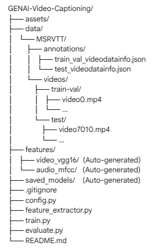

# Audio-Visual Video Captioning with MSR-VTT

This project implements an encoder-decoder deep learning model to generate descriptive English captions for video clips. It leverages a novel fusion approach by using both **visual features** from video frames and **audio features** from the corresponding sound, allowing the model to generate richer, more context-aware descriptions. The model is trained and evaluated on the large-scale MSR-VTT dataset.

## Key Features

* **Dual-Modality Input:** Processes both video and audio streams to understand content more comprehensively.
* **VGG16 for Visual Features:** Utilizes a pre-trained VGG16 model to extract high-level features from sampled video frames.
* **MFCC for Audio Features:** Uses Librosa to extract Mel-Frequency Cepstral Coefficients (MFCCs), a robust representation of audio signals.
* **LSTM-based Encoder-Decoder:** Employs an LSTM-based architecture to encode the fused features and decode them into a sequence of words.
* **Modular & Configurable:** The entire project is structured with a central `config.py` file, making it easy to manage paths and hyperparameters.
* **Evaluation Pipeline:** Includes a script to run inference on the test set and save the predicted captions alongside ground-truth captions in a structured `.csv` file for easy analysis.

---

## Folder Structure

For the scripts to work correctly, your project must follow this directory structure:



---

## Setup and Installation

### 1. Prerequisites
* Python 3.8+
* Pip

### 2. Clone the Repository
Clone this project repository to your local machine.
```bash
git clone <your-repository-url>
cd GENAI-Video-Captioning
```

### 3. Install Dependencies
All required Python libraries should be in `requirements.txt`. Install them using pip:
```bash
pip install -r requirements.txt
```

### 4. Dataset Setup
This project uses the MSR-VTT dataset. You must manually download and place the video and annotation files into the `data/MSRVTT/` directory as shown in the folder structure above.
[MSRVTT Full Dataset on Kaggle](https://www.kaggle.com/datasets/khoahunhtngng/msrvtt)

* **Videos:**
    * Place the training and validation videos (e.g., `video0.mp4` to `video7009.mp4`) inside `data/MSRVTT/videos/train-val/`.
    * Place the testing videos (e.g., `video7010.mp4` to `video9999.mp4`) inside `data/MSRVTT/videos/test/`.
* **Annotations:**
    * Place `train_val_videodatainfo.json` inside `data/MSRVTT/annotations/`.
    * Place `test_videodatainfo.json` inside `data/MSRVTT/annotations/`.

---

## Usage / Workflow

Follow these steps in order to run the complete pipeline.

### Step 1: Extract Features
This script processes the video and audio files and saves the extracted features as `.npy` files in the `features/` directory.
First, run in **debug mode** to quickly process a small subset and verify your setup.

```bash
python feature_extractor.py --mode debug
```
This will process 100 training, 50 validation, and 10 test samples.

### Step 2: Train the Model
This script loads the extracted features and trains the audio-visual captioning model. It saves the best model weights and a tokenizer file in the `saved_models/` directory.

```bash
python train.py
```
The training will begin, showing progress for each epoch.

### Step 3: Evaluate the Model
After training is complete, run this script to generate captions for the test videos and save the output.

```bash
python evaluate.py
```
This will create an `evaluation_results.csv` file in the project's root directory.

### Running in Full Mode
Once you have verified that the entire pipeline works correctly in debug mode, you can train a production-quality model by running the full pipeline:

```bash
# 1. Extract features from all 10,000 videos (this will take a very long time)
python feature_extractor.py --mode full

# 2. Train the model on the full dataset (this will take even longer)
python train.py

# 3. Evaluate the final model on the entire test set
python evaluate.py
```


